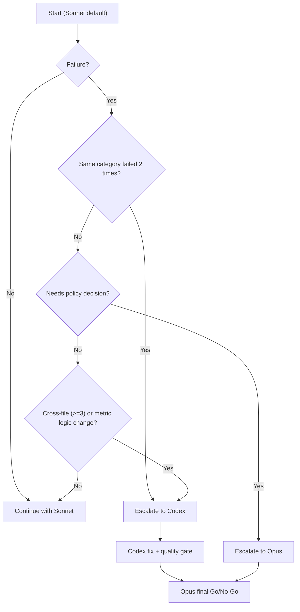

# Agent Orchestration Guide (Opus / Sonnet / Codex)

3エージェント運用の標準手順書。  
単一正本は `CLAUDE.md` の「自動検証ループの起動ルール（3者分担の単一正本）」であり、本書は実務テンプレート集。

## 1. 役割定義

| エージェント | 役割 | 主な責務 |
|-------------|------|----------|
| **Opus** | 操縦者 / メインブレーン | 方針決定、優先順位付け、採択判断（Go/No-Go） |
| **Sonnet** | 実行者 | 定型実装、反復実験、バッチ処理、結果収集 |
| **Codex** | 品質ゲート / 難所修正 | 根本原因分析、横断修正、回帰防止、技術妥当性判定 |

## 2. タスク分類表（誰に渡すか）

| タスク種別 | 推奨担当 |
|-----------|----------|
| 新規テーマの方針策定 | Opus |
| 小規模実装・定型修正 | Sonnet |
| OOS/WFAの反復実行 | Sonnet |
| 複雑バグの切り分け | Codex |
| スコア/WFA/OOSロジック変更 | Codex |
| 最終採択判断 | Opus |

## 3. エスカレーション判定フロー



## 4. 実行テンプレート（依頼文）

### 4.1 Opus依頼テンプレ（方針策定）

```text
[Opus依頼]
目的:
制約:
評価基準:
優先順位:
出力してほしいもの:
- 方針
- 受け入れ基準
- 不採用条件
```

### 4.2 Sonnet依頼テンプレ（実装/実験）

```text
[Sonnet依頼]
固定方針: （Opusの結論を貼る）
実行タスク:
期待成果:
制約:
失敗時:
- handoff_report を作成し、Opus/Codexへ引き継ぐ
```

### 4.3 Codex依頼テンプレ（根本修正/品質ゲート）

```text
[Codex依頼]
症状:
再現手順:
試行済み修正:
期待する修正:
品質ゲート:
- 回帰なし
- OOS/WFAの閾値維持
- 変更理由を説明
```

## 5. handoff_report 仕様

```yaml
handoff_report:
  failure_summary: "失敗要約"
  reproduction_steps:
    - "手順1"
    - "手順2"
  attempted_fixes:
    - "修正A: 失敗"
    - "修正B: 効果なし"
  residual_risks:
    - "残リスク1"
  recommended_escalation_to: "Opus or Codex"
```

## 6. Done定義（完了条件）

以下を満たしたら1サイクル完了:

1. 仕様適合: 方針で定義した要件を満たす  
2. 品質: 主要回帰なし  
3. 評価: OOS/WFA等の基準を満たす  
4. 判断: Opusが最終採択済み  
5. 引継ぎ: 必要なログ・差分・手順が記録済み

## 7. 固定運用値

- デフォルト実行者: **Sonnet**
- 自動エスカレーション閾値: **同種失敗2回**
- 最終技術品質ゲート: **Codex**
- 最終採否判断: **Opus**
- 優先順位: **品質事故防止 > コスト最適化**
- **Opus停止時は開発停止**（回復まで実装・実験・採択判断を保留）

## 8. 障害時フォールバック（最優先）

- Opus停止時:
  - 開発を停止する（実装・実験・採択判断を含む）
  - Sonnet/Codex単独で先行しない
  - 回復後、Opusで方針再確認してから再開する
