# Backtest System ガイド

データローディングから自動最適化パイプラインまでの全体像。

---

## 1. システム全体像

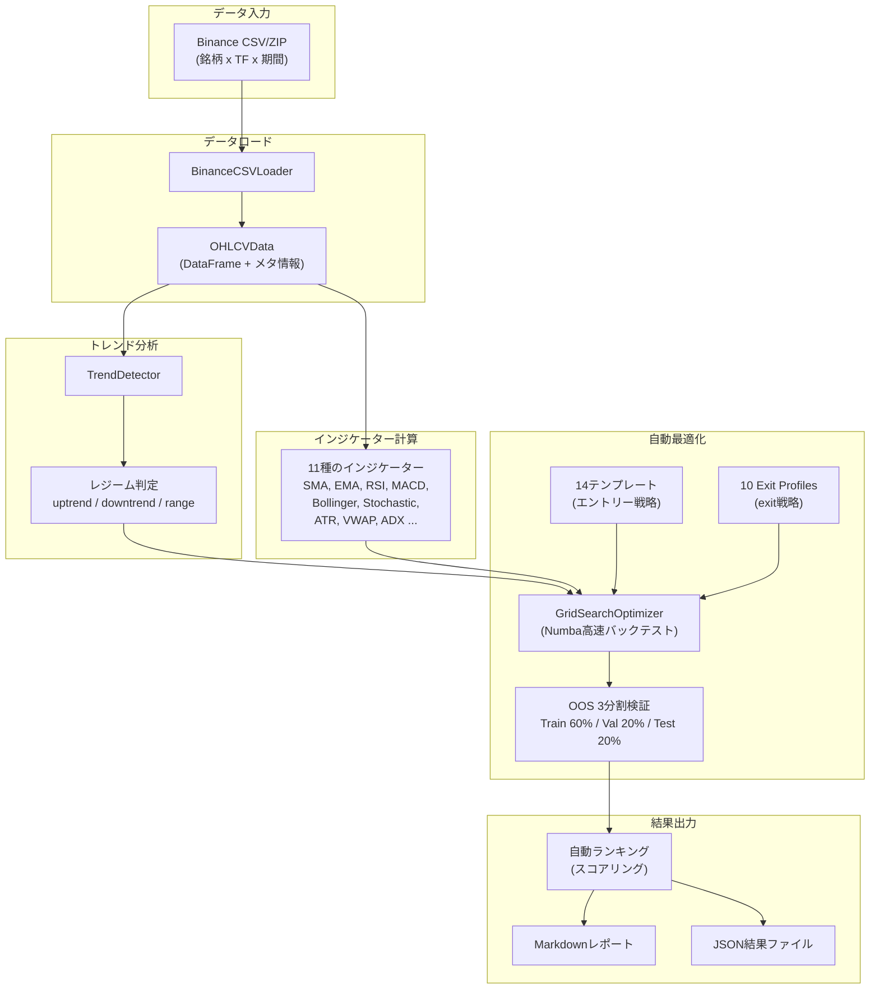

---

## 2. データパイプライン

### 2.1 データの準備

Binance公式データ（data.binance.vision）からダウンロードしたCSV/ZIPを使用。

```
inputdata/
├── BTCUSDT-15m-20240201-20250131-merged.csv
├── BTCUSDT-15m-20250201-20260130-merged.csv
├── BTCUSDT-1h-20240201-20250131-merged.csv
├── BTCUSDT-1m-20240201-20250131-merged.csv
├── BTCUSDT-4h-20240201-20250131-merged.csv
├── ETHUSDT-15m-20240201-20250131-merged.csv
└── ...
```

**ファイル命名規則**: `{銘柄}-{タイムフレーム}-{開始日}-{終了日}-merged.csv`

**対応タイムフレーム**: 1m, 5m, 15m, 30m, 1h, 4h, 1d

### 2.2 ダウンロードスクリプト

```bash
# 複数銘柄を一括ダウンロード（1年分）
python scripts/download_multi_1y.py

# 特定期間のデータを補完
python scripts/backfill_data_period.py
```

### 2.3 データロードの仕組み

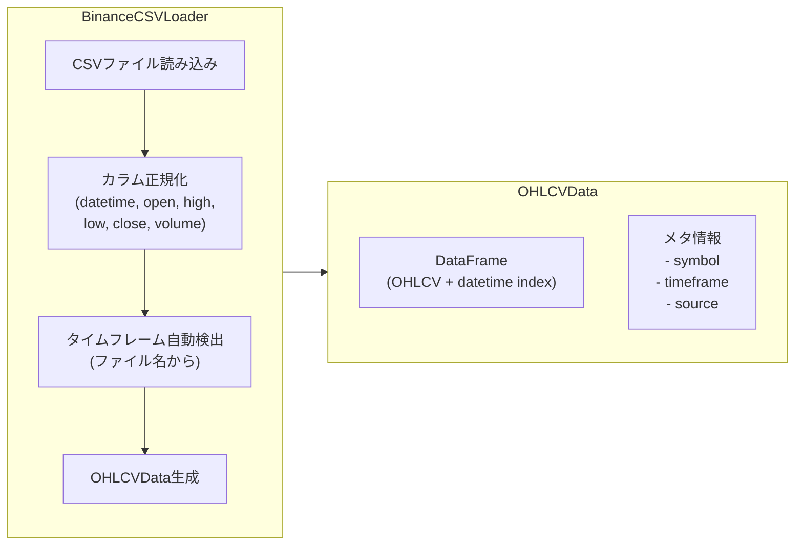

**OHLCVData** はシステム内の統一データ形式。全モジュールがこの形式を前提に動作する。

---

## 3. トレンドレジーム検出

上位足（HTF）の移動平均クロスで相場環境を3分類し、レジームごとに別戦略を適用。

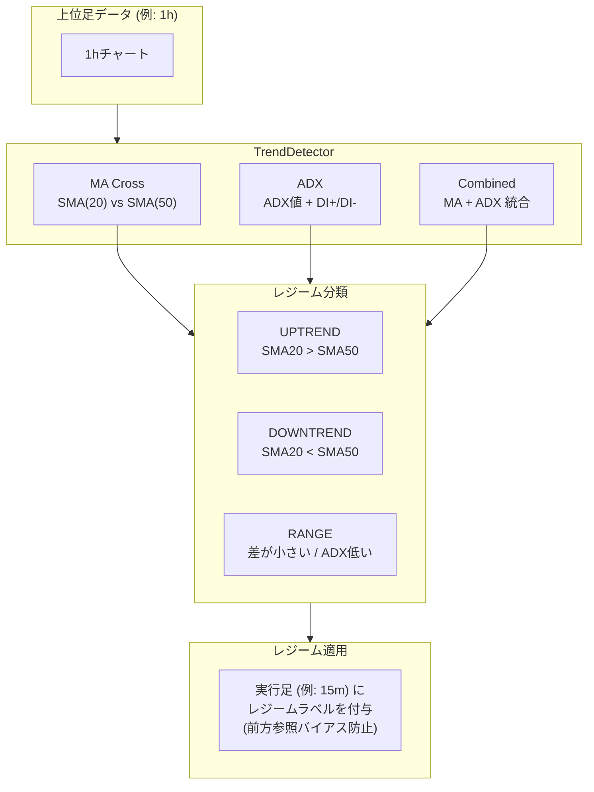

| 検出方法 | ロジック | 用途 |
|---------|---------|------|
| `ma_cross` | SMA(fast) vs SMA(slow) の位置関係 | デフォルト。シンプルで安定 |
| `adx` | ADX > 25 → トレンド、< 20 → レンジ | ボラティリティ感応 |
| `combined` | MA + ADX の統合判定 | より精密だがノイズも多い |

---

## 4. エントリーテンプレート

14種の組み込みテンプレートがあり、各テンプレートがパラメータ範囲を持つ。

### 4.1 テンプレート一覧

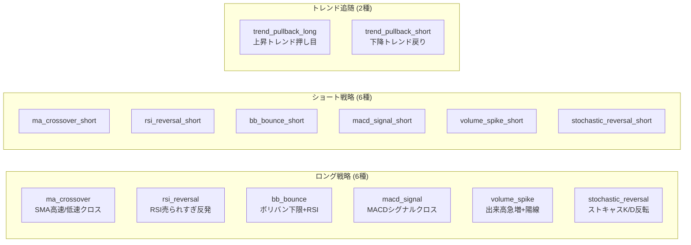

### 4.2 テンプレートの構造

各テンプレートは以下の要素で構成される:

```yaml
name: "ma_crossover"
side: long

# 使用するインジケーター
indicators:
  - type: sma
    period: "{sma_fast}"    # ← パラメータ（グリッドサーチ対象）
  - type: sma
    period: "{sma_slow}"

# エントリー条件
entry_conditions:
  - type: crossover
    fast: "sma_{sma_fast}"
    slow: "sma_{sma_slow}"
    direction: above

entry_logic: and

# 決済条件
exit:
  take_profit_pct: 2.0
  stop_loss_pct: 1.0
```

### 4.3 パラメータ範囲

テンプレートごとに探索するパラメータ範囲が定義されている。

```python
# 例: ma_crossover
param_ranges = [
    ParameterRange("sma_fast", min=10, max=20, step=5, type="int"),
    ParameterRange("sma_slow", min=40, max=60, step=10, type="int"),
]
# → (10,40), (10,50), (10,60), (15,40), ... = 9通り
```

全テンプレートの直積でエントリー条件のバリエーションが生成される。

---

## 5. Exit Profiles（決済戦略）

エントリーとは独立した軸として、10種類のexit戦略を定義。

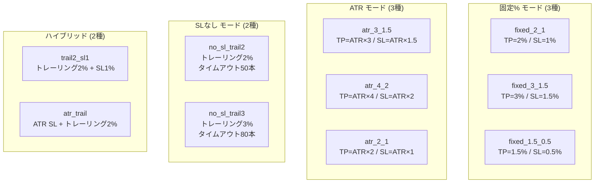

### 固定% vs ATR の違い

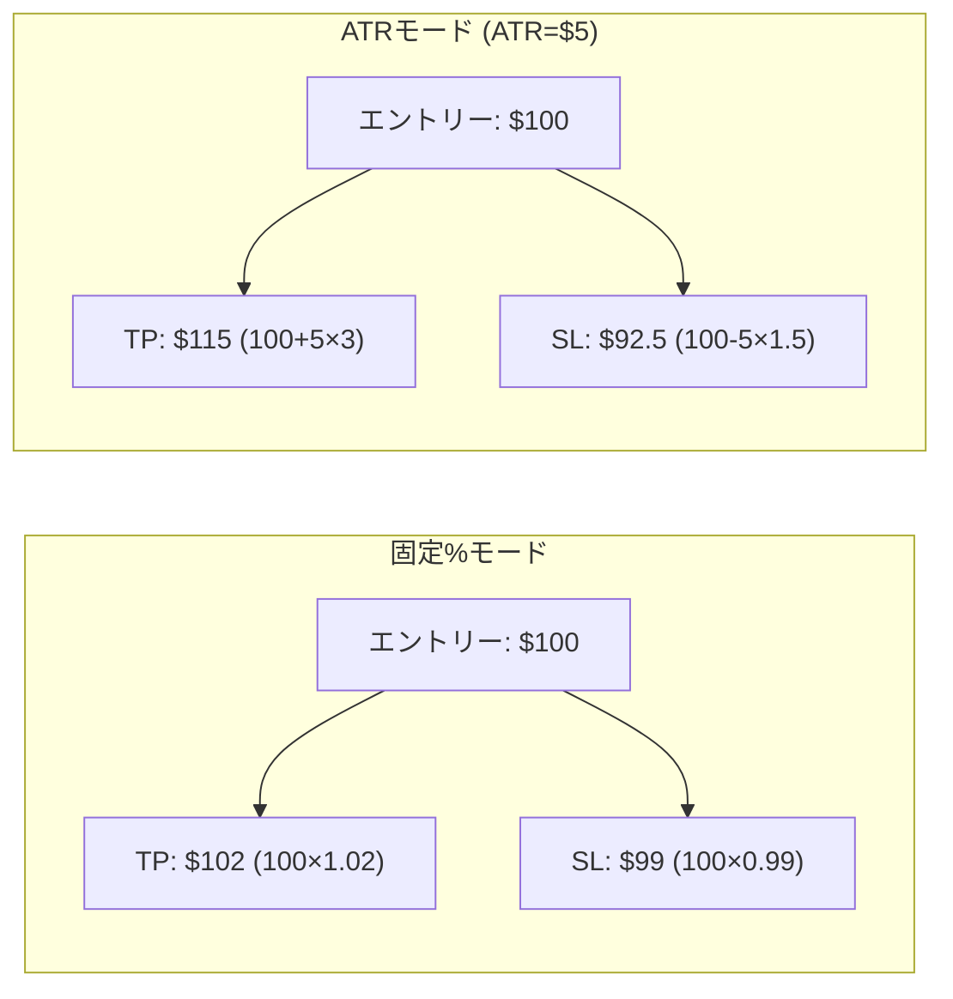

| モード | メリット | デメリット |
|--------|---------|-----------|
| 固定% | シンプル、予測可能 | ボラに適応しない。SLハントされやすい |
| ATR | ボラティリティに自動適応。TF間で一貫 | ATR計算が必要。短期ではノイズに弱い |
| SLなし | SLハント回避。利益を最大限伸ばせる | ドローダウンが大きくなりうる |
| ハイブリッド | バランス型 | パラメータが増える |

### テンプレート × Exit Profile の直積

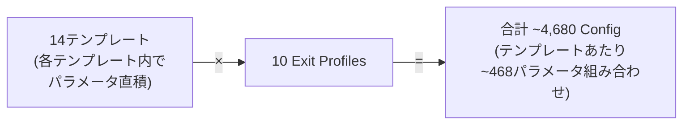

---

## 6. グリッドサーチ最適化

### 6.1 処理フロー

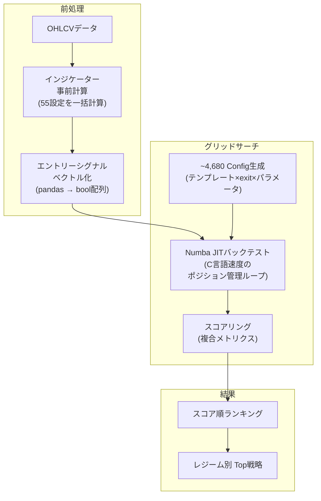

### 6.2 スコアリング

4つのメトリクスを加重平均してスコアを算出:

```
composite_score = PF × 0.3 + WinRate × 0.3 + (1 - MaxDD) × 0.2 + Sharpe × 0.2
```

| メトリクス | 重み | 意味 |
|-----------|------|------|
| Profit Factor | 30% | 総利益 / 総損失 |
| Win Rate | 30% | 勝率 |
| Max Drawdown | 20% | 最大ドローダウン（低いほど良い） |
| Sharpe Ratio | 20% | リスク調整リターン |

### 6.3 Numbaバックテストループ

ポジション管理ループをNumba JITでコンパイルし、C言語並みの速度で実行。

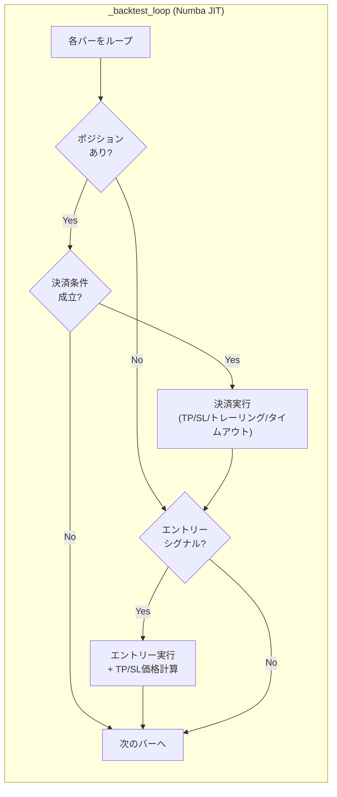

**TP/SL価格計算** (`_compute_tp_sl`):

```
■ 固定%モード (ロング):
  TP = entry_price × (1 + tp_pct / 100)
  SL = entry_price × (1 - sl_pct / 100)

■ ATRモード (ロング):
  TP = entry_price + ATR × tp_mult
  SL = entry_price - ATR × sl_mult

■ SLなし:
  SL = -1.0 (ロング) / 1e18 (ショート) → 到達不可能
```

---

## 7. OOS（Out-of-Sample）検証

過学習を防ぐため、データを3分割して段階的に検証。

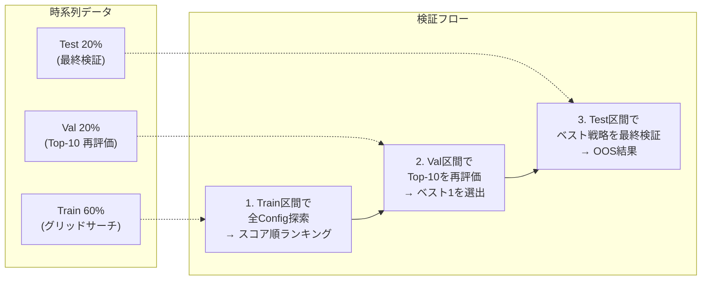

| フェーズ | 目的 | やること |
|---------|------|---------|
| Train (60%) | 戦略探索 | 全4,680コンボをグリッドサーチ |
| Val (20%) | 選別 | Train上位10戦略をVal区間で再テスト |
| Test (20%) | 最終判定 | Val最良の1戦略のみをテスト（1回限り） |

**OOS通過基準**: Test区間でPnL > 0 かつ十分なトレード数

---

## 8. バッチ自動最適化パイプライン

全条件を一括実行するスクリプト。

### 8.1 実行コマンド

```bash
# フル実行（全TF × 全銘柄 × 全期間 × 全exit profiles）
python scripts/batch_optimize.py

# TF指定
python scripts/batch_optimize.py --tf-combos 15m:1h,15m:4h,1h:4h

# exit profilesを限定
python scripts/batch_optimize.py --exit-profiles fixed

# 小規模テスト
python scripts/batch_optimize.py \
  --symbols BTCUSDT,ETHUSDT \
  --periods 20250201-20260130 \
  --tf-combos 15m:1h

# OOSなし（高速）
python scripts/batch_optimize.py --no-oos
```

### 8.2 CLIオプション一覧

| オプション | デフォルト | 説明 |
|-----------|----------|------|
| `--symbols` | 全銘柄 | 対象銘柄（カンマ区切り） |
| `--periods` | 2024 + 2025 | 対象期間（カンマ区切り） |
| `--tf-combos` | all (6種) | TF組み合わせ |
| `--exit-profiles` | all (10種) | Exit profiles |
| `--workers` | 4 | 並列ワーカー数 |
| `--oos` | ON | OOS 3分割検証を有効化 |
| `--no-oos` | - | OOS検証なし |
| `--force` | - | 既存結果を上書き |

### 8.3 TF組み合わせ

実行足（エントリー判定）と上位足（トレンド判定）のペア。

| 実行足 | 上位足 | 用途 |
|--------|-------|------|
| 1m | 15m | 超短期スキャルピング |
| 1m | 1h | 短期スキャルピング |
| **15m** | **1h** | **中期（標準）** |
| 15m | 4h | 中期スイング |
| 1h | 4h | スイング |
| 1h | 1d | 長期スイング |

### 8.4 パイプライン全体フロー

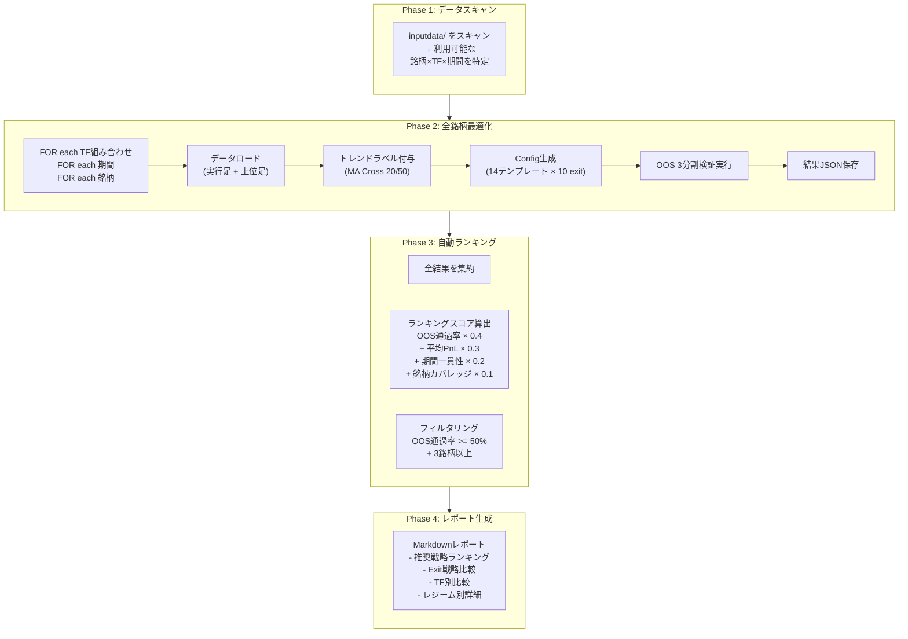

### 8.5 出力ディレクトリ構造

```
results/batch/{timestamp}/
├── config.json                  # 実行設定
├── optimization/                # 銘柄別OOS結果
│   ├── BTCUSDT_20240201-20250131_15m_1h.json
│   ├── BTCUSDT_20250201-20260130_15m_1h.json
│   ├── ETHUSDT_20240201-20250131_15m_1h.json
│   └── ...
├── ranking.json                 # 自動ランキング結果
└── report.md                    # 最終Markdownレポート
```

### 8.6 自動ランキングスコア

```
score = OOS通過率 × 0.4
      + normalize(平均OOS PnL) × 0.3
      + 期間一貫性 × 0.2
      + 銘柄カバレッジ × 0.1
```

| 指標 | 重み | 意味 |
|------|------|------|
| OOS通過率 | 40% | Test区間で利益が出た割合 |
| 平均OOS PnL | 30% | OOS通過時の平均リターン |
| 期間一貫性 | 20% | 2024年と2025年の両方で通過しているか |
| 銘柄カバレッジ | 10% | 何銘柄で有効だったか |

---

## 9. レジーム × 戦略 マトリクス

各レジームに最適な戦略を自動選択する仕組み。

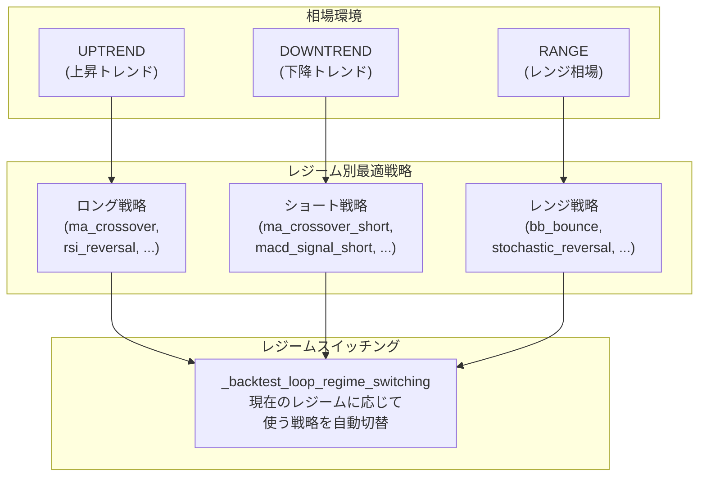

---

## 10. ディレクトリ構成

```
backtest-system/
├── analysis/           # トレンドレジーム検出
│   └── trend.py        #   TrendDetector (MA Cross / ADX / Combined)
├── config/             # グローバル設定
│   └── settings.py
├── data/               # データローディング
│   ├── base.py         #   OHLCVData
│   ├── binance_loader.py  # BinanceCSVLoader
│   └── csv_loader.py   #   汎用CSVLoader
├── engine/             # バックテストエンジン
│   └── numba_loop.py   #   Numba JIT ループ
├── indicators/         # テクニカルインジケーター (11種)
│   └── registry.py     #   INDICATOR_REGISTRY
├── metrics/            # メトリクス計算
│   └── calculator.py   #   BacktestMetrics
├── optimizer/          # 最適化エンジン
│   ├── grid.py         #   GridSearchOptimizer
│   ├── templates.py    #   14 BUILTIN_TEMPLATES
│   ├── exit_profiles.py #  10 Exit Profiles
│   ├── validation.py   #   OOS 3分割検証
│   ├── scoring.py      #   複合スコアリング
│   ├── results.py      #   OptimizationResultSet
│   └── regime_switching.py # レジームスイッチング
├── strategy/           # 戦略定義
│   ├── base.py         #   ExitRule, EntryCondition
│   └── builder.py      #   ConfigStrategy
├── scripts/            # バッチスクリプト
│   └── batch_optimize.py  # 全自動最適化パイプライン
├── inputdata/          # 入力データ (CSV)
├── results/            # 最適化結果 (JSON/Markdown)
└── tests/              # テスト (117件)
```
