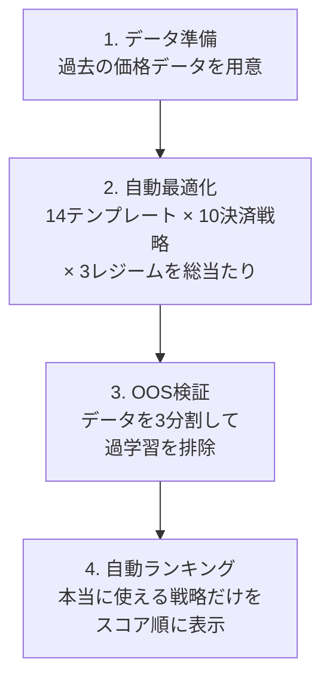
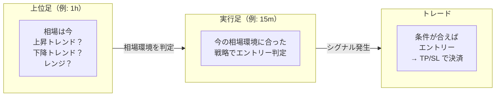
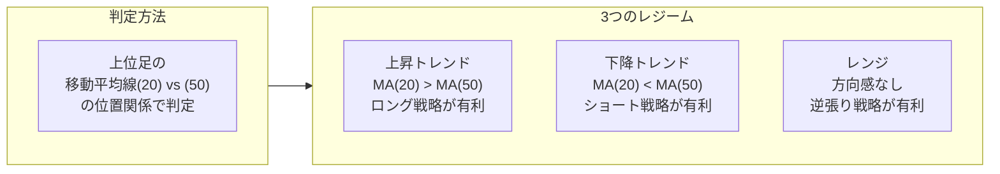
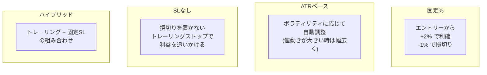
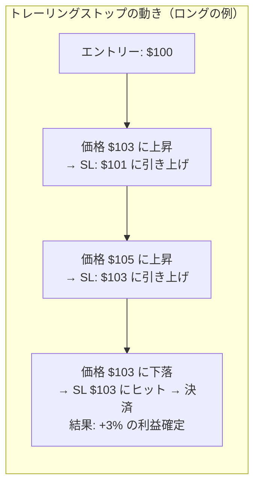
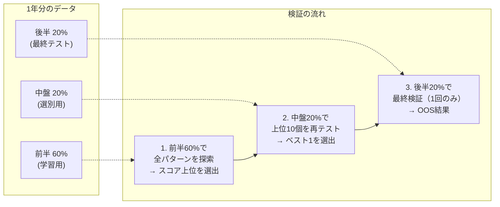
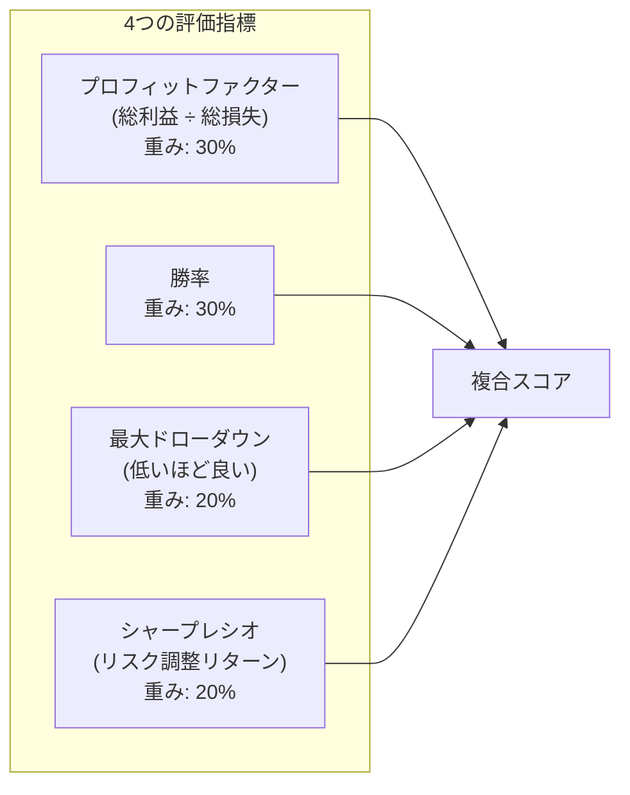

# Prism ユーザーガイド

仮想通貨の売買戦略を自動で探索・検証するツール。
「どのルールで売買すれば利益が出たか？」を過去データで網羅的にテストし、
有望な戦略を見つける。

---

## このツールで何ができる？

- 30銘柄 × 複数の時間足 × 2年分のデータ を一括検証
- 「過去1年で利益が出た」だけでなく「未知のデータでも利益が出たか」を3分割検証（OOS）
- 過学習（たまたまハマっただけ）の戦略を自動で警告

---

## 全体の流れ

---

## データ

価格データ（OHLCV = 始値・高値・安値・終値・出来高）をCSVで用意する。

読み込み方法は3つ:
- Binance CSV/ZIP（ディレクトリ指定で一括読み込み）
- TradingView CSV（手動エクスポート）
- ドラッグ&ドロップ（複数ファイル対応）

**ポイント:**
- 最低1つの時間足があれば動作する
- 2つの時間足（実行足 + 上位足）を読むと、相場環境に応じた戦略切り替えが可能

---

## 時間足の組み合わせ

2つの時間足を使う。「実行足」でエントリー判定、「上位足」で相場環境を判定。

| 実行足 | 上位足 | 特徴 |
|--------|-------|------|
| 1m | 15m | 超短期スキャルピング |
| **15m** | **1h** | **標準。バランスが良い** |
| 15m | 4h | 中期スイング向け |
| 1h | 4h | スイングトレード |

---

## レジーム（相場環境）

相場は常に同じ状態ではない。大きく3つの環境に分け、それぞれに最適な戦略を使い分ける。

上昇トレンドでは買い戦略、下降トレンドでは売り戦略、レンジでは逆張り。
最適化ではレジームごとに最適な戦略を自動で選ぶ。

---

## 14種のエントリーテンプレート

自動で試すエントリー戦略の一覧。

### ロング（買い）戦略 — 6種

| テンプレート | 何をするか | 狙い |
|------------|-----------|------|
| ma_crossover | 短期移動平均が長期移動平均を上抜け | トレンド転換の初動 |
| rsi_reversal | RSIが売られすぎ水準から反発 | 下がりすぎの反動 |
| bb_bounce | ボリンジャーバンド下限にタッチ | バンド下限からの反発 |
| macd_signal | MACDラインがシグナルを上抜け | 勢いの転換 |
| volume_spike | 出来高急増 + 陽線 | 大口の買いを察知 |
| stochastic_reversal | ストキャスティクスが売られすぎから反転 | 短期的な反発 |

### ショート（売り）戦略 — 6種

上記6種の逆バージョン（上抜け→下抜け、売られすぎ→買われすぎ、等）。
下降トレンドや天井圏で使用。

### トレンド追随戦略 — 2種

| テンプレート | 何をするか |
|------------|-----------|
| trend_pullback_long | 上昇トレンド中の押し目で買い |
| trend_pullback_short | 下降トレンド中の戻りで売り |

各テンプレートはパラメータの範囲を持っており（例: 移動平均の期間を10〜30で変える）、
全組み合わせを自動で試す。

---

## 決済戦略（Exit Profiles）

「いつ利確/損切りするか」のルール。エントリー戦略とは独立に設定できる。
全10種が用意されており、エントリー × 決済 の全組み合わせが自動テストされる。

| 決済戦略 | 利確 | 損切り | 向いている場面 |
|---------|------|--------|-------------|
| **固定% (3種)** | +2% 等 | -1% 等 | シンプルに使いたい |
| **ATR (3種)** | ATR×3 等 | ATR×1.5 等 | ボラが変わる銘柄 |
| **SLなし (2種)** | なし | なし（トレーリングで管理） | 利益を伸ばしたい |
| **ハイブリッド (2種)** | なし | 固定 or ATR | バランス型 |

### ATR（Average True Range）とは？

直近14本の平均的な値動き幅を測る指標。

- BTC が1日に $2,000 動く時期 → ATR大 → TP/SLの幅も自動で広がる
- BTC が1日に $500 しか動かない時期 → ATR小 → TP/SLの幅も自動で狭まる

固定%だとボラの高い時期にSLが狩られやすい問題を、ATRベースなら自動回避できる。

### トレーリングストップとは？

価格が有利な方向に動くたびに損切りラインも追従する仕組み。

利益が出ている間はポジションを持ち続け、反転したら自動決済。
固定のTPを置かないので、大きなトレンドに乗れる可能性がある。

---

## OOS（Out-of-Sample）検証

「過学習していないか」を確かめる仕組み。このシステムの最も重要な機能。

### なぜ必要か？

過去データで「たまたま上手くいった」戦略は、未来では通用しない。これが**過学習**。

例えば1,000パターンを試せば、偶然どれかは利益が出る。
それを「最強の戦略を発見した！」と信じてしまうのが一番危険。

データを3つに分け、最後の20%は一切チューニングに使わないことで、
「本当に未知のデータでも機能するか」をテストする。

| 結果 | 意味 |
|------|------|
| OOS通過（Test区間で利益あり） | 一定の信頼性がある |
| OOS不通過（Test区間で損失） | 過学習の可能性が高い → 不採用 |

---

## レポートの読み方

自動最適化後に生成されるレポートの見方。

### 推奨戦略ランキング

OOS通過率が高く、複数銘柄で有効な戦略が上位に来る。

| 見るべきポイント | 意味 |
|---------------|------|
| OOS通過率 | 高いほど信頼性あり（60%以上が目安） |
| 平均PnL | OOS通過時の平均リターン |
| 銘柄数 | 何銘柄で有効だったか（多いほど汎用的） |
| 期間一貫性 | 2024年と2025年の両方で有効か |

### Exit戦略比較

どの決済方法が全体的に良い成績だったかが分かる。
「固定%よりATRの方がOOS通過率が高い」といった傾向を見る。

### レジーム別比較

上昇/下降/レンジのどの環境で、どの戦略が強いかが分かる。
一般に、上昇トレンドのロング戦略は過学習しやすい（上昇相場ならどんな買い戦略でも利益が出るため）。

---

## スコアリング

戦略の良し悪しは4つの指標の加重平均で判定される。

| 指標 | 意味 | 良い値の目安 |
|------|------|------------|
| プロフィットファクター | 利益÷損失。1以上で利益が出ている | 1.5 以上 |
| 勝率 | 全トレード中の勝ち割合 | 50% 以上 |
| 最大ドローダウン | 資産が一時的に最大何%減ったか | 15% 以下 |
| シャープレシオ | リスクに見合ったリターンか | 1.0 以上 |

---

## 注意点

- **OOS通過 = 未来でも儲かる保証ではない。** あくまで「過学習でない可能性が高い」という意味。
- **レポートで上位の戦略でも、必ずリスクがある。** 少額からのテスト運用が推奨。
- **相場環境は変化する。** 2024-2025年で有効だった戦略が2026年でも有効とは限らない。定期的な再検証が必要。
- **バックテストには手数料・スリッページが含まれている**（片道0.04%）が、実際の約定はもっと悪い場合がある。
